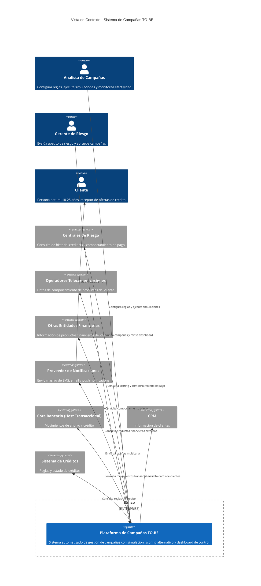
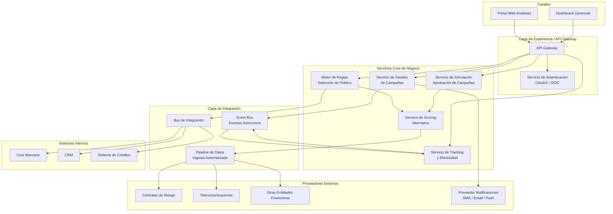
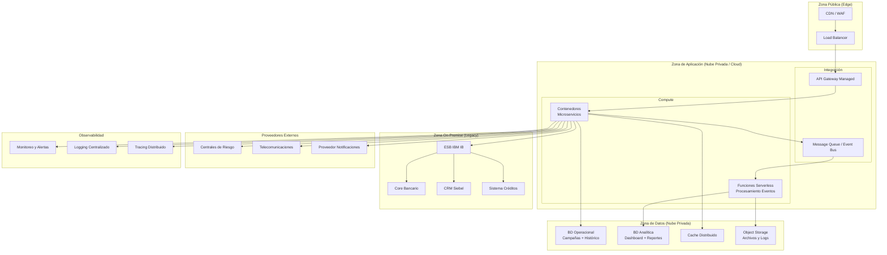
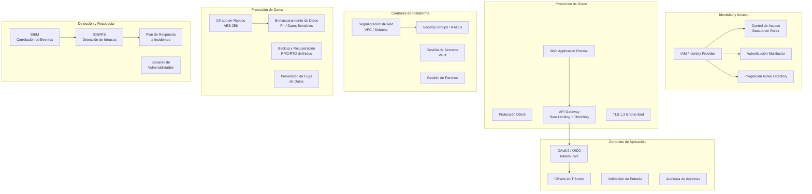
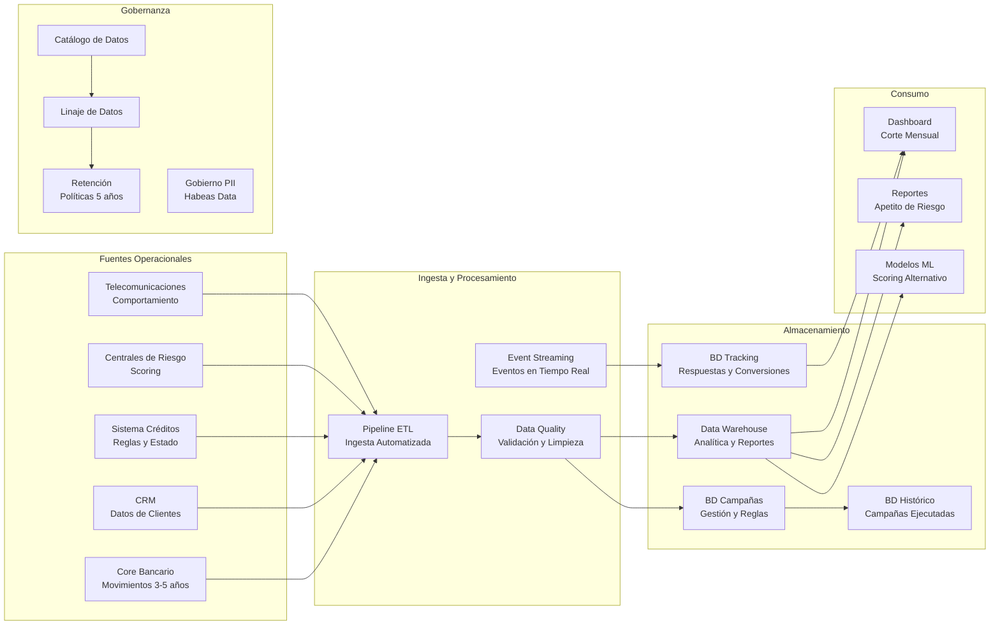

# Arquitectura de Solución TO-BE - Sistema de Campañas

## 1. Vista de Contexto y Capacidades de Negocio

### Descripción
Solución multinube para la gestión automatizada de campañas de crédito dirigidas a personas naturales (18-25 años), con capacidades de simulación, scoring, notificación multicanal y dashboard de control.

### Restricciones de Diseño
- No se proponen procesos manuales
- Historia crediticia del cliente no es amplia — se complementa con fuentes alternativas
- Notificación al cliente por SMS, correo electrónico y mensajes push
- Arquitectura multinube evolutiva (MVP + releases futuros)

### Reglas de Público Objetivo
- Historial crediticio y comportamiento de pago con centrales de riesgo
- Comportamiento de ingresos/egresos en cuentas del pasivo (3-5 años)
- Comportamiento de productos con telefónicas y otras entidades financieras

## 2. Vista de Arquitectura de Aplicación (Software)

### MVP (Release 1)
- Motor de reglas automatizado para selección de público objetivo
- Integración con centrales de riesgo
- Módulo de simulación de campañas
- Dashboard de control y seguimiento
- Notificación multicanal (SMS + Email + Push)
- Histórico de campañas

### Release 2 (Evolución)
- Integración con telecomunicaciones y otras entidades financieras
- Motor de Machine Learning para scoring alternativo
- Personalización avanzada de ofertas
- A/B testing de campañas

## 3. Vista de Arquitectura de Infraestructura (Multinube)

## 4. Vista de Arquitectura de Seguridad

## 5. Vista de Datos

## Roadmap de Evolución

| Release | Alcance | Capacidades |
|---------|---------|-------------|
| **MVP (R1)** | Core de campañas automatizado | Motor de reglas, integración core bancario + CRM + créditos + centrales de riesgo, simulación de campañas, dashboard de control, notificación SMS/Email/Push, histórico de campañas |
| **Release 2** | Scoring alternativo y fuentes externas | Integración telecomunicaciones y otras entidades financieras, motor ML para scoring alternativo, personalización de ofertas, A/B testing |
| **Release 3** | Optimización y autoservicio | Autoservicio para analistas (reglas sin código), optimización automática de campañas, predicción de conversión, integración con canales digitales del banco |

## Decisiones Arquitectónicas Base

| Aspecto | Decisión |
|---------|----------|
| Estilo de servicio | Microservicios en contenedores con funciones serverless para procesamiento de eventos |
| Integración síncrona | API REST vía API Gateway para servicios internos |
| Integración asíncrona | Event Bus para tracking, notificaciones y procesamiento batch |
| Integración legacy | ESB IBM Integration Bus como puente hacia core bancario, CRM y créditos |
| Consistencia | Eventual consistency para tracking y analítica; strong consistency para reglas y aprobación |
| Disponibilidad | Alta disponibilidad en zona de aplicación (multi-AZ); RPO < 1h, RTO < 4h |
| Compliance | Habeas Data, regulación bancaria local, cifrado de PII |
| Multinube | Capa de aplicación cloud-agnostic (contenedores); datos sensibles en nube privada |

## Sobre Mensajes Push

Los mensajes push son notificaciones enviadas directamente al dispositivo móvil del cliente a través de la app del banco (si existe) o servicios como Firebase Cloud Messaging / Apple Push Notifications. **Generan valor** porque:
- Tasa de apertura ~90% vs ~20% del email
- Entrega inmediata sin costo por mensaje (a diferencia de SMS)
- Permiten deep linking a la solicitud de crédito en la app
- Se incluyen en la propuesta como canal adicional del MVP
