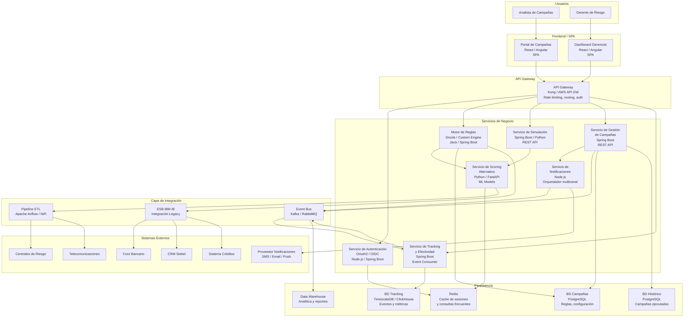
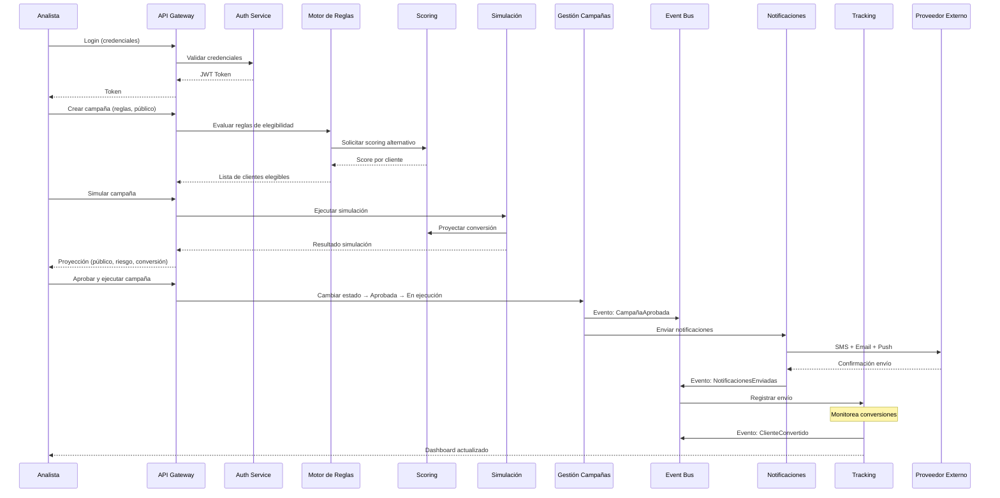
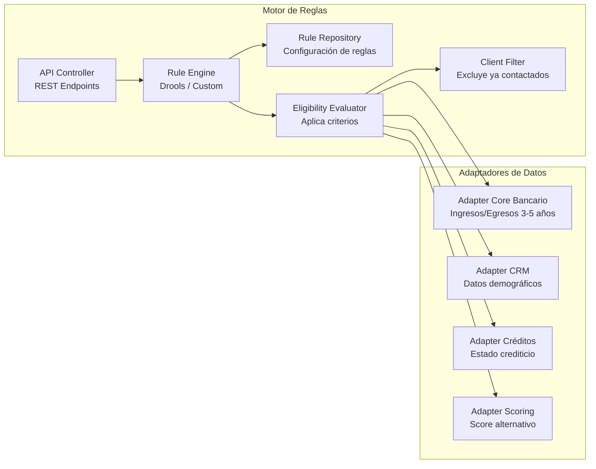

# Arquitectura de Software - Sistema de Campañas TO-BE

## 1. Visión General

Arquitectura basada en microservicios desplegados en contenedores, con comunicación
síncrona vía API REST y asíncrona vía Event Bus. Separación clara entre capa de
presentación, servicios de negocio, integración y persistencia.

---

## 2. Diagrama de Contenedores (C4 Nivel 2)



## 3. Detalle de Componentes

### 3.1 Frontend / SPA

| Componente | Tecnología | Responsabilidad |
|------------|-----------|-----------------|
| Portal de Campañas | React o Angular SPA | Configuración de reglas, ejecución de simulaciones, gestión de campañas |
| Dashboard Gerencial | React o Angular SPA | Visualización de métricas, apetito de riesgo, control de conversión |

**Patrones:**
- Single Page Application con lazy loading
- Comunicación con backend exclusivamente vía API Gateway
- Autenticación con tokens JWT (OAuth2/OIDC)
- Responsive design para acceso desde múltiples dispositivos

### 3.2 API Gateway

| Aspecto | Detalle |
|---------|---------|
| Tecnología | Kong / AWS API Gateway / Azure APIM |
| Responsabilidades | Routing, rate limiting, throttling, autenticación, versionado de APIs |
| Protocolo | HTTPS (TLS 1.3) |
| Autenticación | Validación de JWT tokens |

### 3.3 Servicios de Negocio

#### Servicio de Autenticación
| Aspecto | Detalle |
|---------|---------|
| Tecnología | Node.js o Spring Boot |
| Protocolo | OAuth2 / OpenID Connect |
| Integración | Active Directory (LDAP) |
| Responsabilidad | Login, emisión de tokens, refresh, MFA, RBAC |
| Base de datos | Redis (sesiones y tokens) |

#### Motor de Reglas
| Aspecto | Detalle |
|---------|---------|
| Tecnología | Java / Spring Boot + Drools o motor custom |
| Responsabilidad | Evaluación de criterios de elegibilidad del público objetivo |
| Reglas implementadas | Historial crediticio, comportamiento de pago, ingresos/egresos (3-5 años), productos telecom |
| Integración | ESB (core, CRM, créditos), Servicio de Scoring |
| Base de datos | PostgreSQL (reglas y configuración) |
| Patrón | Strategy pattern para reglas intercambiables |

#### Servicio de Simulación
| Aspecto | Detalle |
|---------|---------|
| Tecnología | Spring Boot o Python/FastAPI |
| Responsabilidad | Simular resultado de campaña antes de aprobación |
| Funcionalidad | Proyección de público elegible, estimación de conversión, análisis de riesgo |
| Integración | Motor de Reglas, Scoring Alternativo |
| Patrón | Command pattern para simulaciones reproducibles |

#### Servicio de Gestión de Campañas
| Aspecto | Detalle |
|---------|---------|
| Tecnología | Java / Spring Boot |
| Responsabilidad | CRUD de campañas, ciclo de vida, aprobación, ejecución, histórico |
| Estados | Borrador → Simulada → Aprobada → En ejecución → Completada → Archivada |
| Integración | Event Bus (publica eventos), Servicio de Notificaciones |
| Base de datos | PostgreSQL (campañas + histórico) |
| Patrón | State machine para ciclo de vida |

#### Servicio de Scoring Alternativo
| Aspecto | Detalle |
|---------|---------|
| Tecnología | Python / FastAPI |
| Responsabilidad | Calcular score crediticio alternativo para clientes sin historia amplia |
| Fuentes | Centrales de riesgo, comportamiento telecom, otras entidades financieras |
| Modelos | ML supervisado (clasificación de riesgo) |
| Integración | Pipeline ETL (ingesta de datos externos), Cache (resultados) |
| Patrón | Model serving con versionado de modelos |

#### Servicio de Tracking y Efectividad
| Aspecto | Detalle |
|---------|---------|
| Tecnología | Java / Spring Boot |
| Responsabilidad | Registrar respuestas de clientes, medir conversión, alimentar dashboard |
| Funcionalidad | Clientes notificados vs. clientes que solicitaron producto → excluir de siguiente campaña |
| Integración | Event Bus (consume eventos), BD Tracking |
| Base de datos | TimescaleDB o ClickHouse (series temporales y métricas) |
| Patrón | Event sourcing para trazabilidad completa |

**Responsabilidades detalladas:**

| Responsabilidad | Detalle |
|----------------|---------|
| Registrar envíos | Qué clientes fueron notificados, por qué canal, cuándo |
| Registrar respuestas | Quién abrió el email, quién hizo clic, quién ignoró |
| Detectar conversiones | Cruzar con el core bancario: el cliente solicitó un producto del banco |
| Generar exclusiones | Marcar clientes convertidos para NO incluirlos en la siguiente campaña |
| Alimentar dashboard | Enviar métricas agregadas a BigQuery para el corte mensual |
| Calcular efectividad | Tasa de conversión por campaña, canal, segmento, producto |

**Flujo interno:**

1. EventBridge/SQS recibe evento `NotificaciónEnviada` → Registra: clienteId, campañaId, canal, timestamp
2. Proveedor de Notificaciones envía webhook `EmailAbierto` / `SMSEntregado` → Registra interacción
3. Core Bancario emite evento periódico `ClienteSolicitóProducto` → Cruza con campañas activas → Si el cliente estaba en una campaña, marca como CONVERTIDO → Publica evento `ClienteConvertido` → Agrega a lista de exclusión
4. Cada hora agrega métricas y envía a Kinesis Firehose → BigQuery

**Datos que almacena:**

| Dato | Ejemplo | Uso |
|------|---------|-----|
| Envío | clienteId: 123, campañaId: 45, canal: SMS, fecha: 2026-05-21 | Trazabilidad |
| Interacción | clienteId: 123, acción: abrió_email, fecha: 2026-05-21 | Medir engagement |
| Conversión | clienteId: 123, producto: microcrédito, fecha: 2026-05-23 | Medir ROI |
| Exclusión | clienteId: 123, razón: ya_solicitó, desde: 2026-05-23 | No re-contactar |

**Métricas que genera para el Dashboard:**

| Métrica | Fórmula | Ejemplo |
|---------|---------|---------|
| Tasa de entrega | Entregados / Enviados | 95% |
| Tasa de apertura | Abiertos / Entregados | 35% |
| Tasa de conversión | Solicitaron producto / Notificados | 8% |
| Costo por conversión | Costo campaña / Conversiones | $2,500 COP |
| Efectividad por canal | Conversiones por canal / Total canal | SMS: 5%, Email: 3%, Push: 12% |
| Clientes excluidos | Total que ya solicitaron | 1,200 este mes |

**Relación con el Dashboard del Gerente de Riesgo:**

- Corte mensual: cuántos clientes se notificaron vs cuántos solicitaron producto
- Apetito de riesgo semestral: si la conversión es alta y la mora es baja, aumentar criterios; si la mora sube, restringir
- Exclusión automática: garantizar que no se re-contacte a quien ya respondió

**Por qué es un servicio separado (no parte de Gestión de Campañas):**

- Desacoplamiento temporal: el tracking ocurre días/semanas después del envío, no debe bloquear la ejecución
- Volumen diferente: procesa millones de eventos (cada apertura, cada SMS entregado) vs. decenas de campañas
- Escalabilidad independiente: puede escalar horizontalmente sin afectar el servicio de campañas
- Event sourcing: almacena todos los eventos de forma inmutable para auditoría regulatoria

#### Servicio de Notificaciones
| Aspecto | Detalle |
|---------|---------|
| Tecnología | Node.js |
| Responsabilidad | Orquestar envío multicanal (SMS, Email, Push) |
| Lógica | Selección de canal por preferencia del cliente, fallback automático |
| Integración | Proveedor externo de notificaciones, Event Bus |
| Patrón | Template method para diferentes canales |

### 3.4 Capa de Integración

| Componente | Tecnología | Responsabilidad |
|------------|-----------|-----------------|
| Event Bus | Kafka o RabbitMQ | Comunicación asíncrona entre servicios. Eventos: CampañaCreada, CampañaAprobada, NotificaciónEnviada, ClienteConvertido |
| ESB IBM IB | IBM Integration Bus (existente) | Puente hacia sistemas legacy (Core, CRM, Créditos) |
| Pipeline ETL | Apache Airflow o NiFi | Ingesta automatizada de fuentes externas (centrales, telecom, otras entidades) |

### 3.5 Persistencia

| Store | Tecnología | Datos | Patrón |
|-------|-----------|-------|--------|
| BD Campañas | PostgreSQL | Reglas, configuración, campañas activas | CRUD operacional |
| BD Histórico | PostgreSQL | Campañas ejecutadas, resultados | Append-only |
| BD Tracking | TimescaleDB / ClickHouse | Eventos, métricas, conversiones | Time-series |
| Data Warehouse | PostgreSQL / Redshift | Analítica consolidada para dashboard | CQRS read model |
| Cache | Redis | Sesiones, tokens, scoring frecuente | Cache-aside |

## 4. Diagrama de Secuencia - Flujo Principal



## 5. Diagrama de Componentes - Motor de Reglas (Detalle)



## 6. Eventos del Sistema

| Evento | Productor | Consumidor | Payload |
|--------|-----------|------------|---------|
| CampañaCreada | Gestión Campañas | Tracking | campaignId, rules, targetCount |
| CampañaAprobada | Gestión Campañas | Notificaciones, Tracking | campaignId, approvedBy, clientList |
| NotificaciónEnviada | Notificaciones | Tracking | campaignId, clientId, channel, status |
| ClienteConvertido | Tracking | Gestión Campañas | campaignId, clientId, productRequested |
| ScoringCalculado | Scoring | Motor de Reglas | clientId, score, sources, confidence |
| SimulaciónCompletada | Simulación | Gestión Campañas | campaignId, projectedConversion, riskLevel |

## 7. APIs Principales

### Campañas API
```
POST   /api/v1/campaigns              - Crear campaña
GET    /api/v1/campaigns               - Listar campañas
GET    /api/v1/campaigns/{id}          - Detalle de campaña
PUT    /api/v1/campaigns/{id}          - Actualizar campaña
POST   /api/v1/campaigns/{id}/simulate - Ejecutar simulación
POST   /api/v1/campaigns/{id}/approve  - Aprobar campaña
POST   /api/v1/campaigns/{id}/execute  - Ejecutar campaña
GET    /api/v1/campaigns/{id}/results  - Resultados y tracking
```

### Reglas API
```
POST   /api/v1/rules/evaluate          - Evaluar reglas sobre población
GET    /api/v1/rules                    - Listar reglas activas
POST   /api/v1/rules                    - Crear regla
PUT    /api/v1/rules/{id}              - Actualizar regla
```

### Scoring API
```
POST   /api/v1/scoring/calculate        - Calcular score para lista de clientes
GET    /api/v1/scoring/{clientId}       - Score individual
GET    /api/v1/scoring/sources          - Fuentes disponibles
```

### Dashboard API
```
GET    /api/v1/dashboard/summary        - Resumen mensual
GET    /api/v1/dashboard/conversion     - Tasa de conversión
GET    /api/v1/dashboard/risk-appetite  - Indicadores de apetito de riesgo
GET    /api/v1/dashboard/exclusions     - Clientes excluidos (ya solicitaron)
```

## 8. Patrones de Diseño Aplicados

| Patrón | Dónde se aplica | Beneficio |
|--------|----------------|-----------|
| CQRS | Dashboard (lectura) vs Campañas (escritura) | Optimiza lectura analítica sin afectar operacional |
| Event Sourcing | Tracking de efectividad | Trazabilidad completa, reconstrucción de estado |
| Circuit Breaker | Integración con sistemas externos | Resiliencia ante fallos de legacy o proveedores |
| Strategy | Motor de Reglas | Reglas intercambiables sin modificar código |
| State Machine | Ciclo de vida de campañas | Control explícito de transiciones válidas |
| Cache-Aside | Scoring, sesiones | Reduce latencia y carga en fuentes externas |
| Adapter | Integración con core, CRM, créditos | Desacopla lógica de negocio de protocolos legacy |
| Template Method | Notificaciones multicanal | Reutiliza lógica común entre canales |

### 8.1 CQRS (Command Query Responsibility Segregation)

Separa las operaciones de escritura (commands) de las de lectura (queries) en modelos de datos distintos, cada uno optimizado para su propósito.

**Aplicación en este proyecto:**
- **Escritura (Command):** Cuando el analista crea, aprueba o ejecuta una campaña, se escribe en DynamoDB (campañas operacionales) optimizado para transacciones rápidas.
- **Lectura (Query):** Cuando el gerente consulta el dashboard mensual, lee de BigQuery (analítica) optimizado para agregaciones y queries complejos sobre millones de registros.
- **Justificación:** El dashboard necesita cruzar datos de 100K+ clientes con métricas de conversión. Si leyera de la misma BD operacional, degradaría el performance de las campañas activas.

### 8.2 Event Sourcing

En lugar de guardar solo el estado actual, se almacena la secuencia completa de eventos que produjeron ese estado. El estado se puede reconstruir "reproduciendo" los eventos.

**Aplicación en este proyecto:**
- El servicio de Tracking guarda cada evento: `NotificaciónEnviada`, `ClienteAbrióEmail`, `ClienteSolicitóProducto`, `ClienteExcluido`.
- Si se necesita saber "qué pasó con la campaña X", se reproducen los eventos y se obtiene la historia completa.
- **Justificación:** El banco necesita trazabilidad total por regulación. Si un cliente reclama que lo contactaron indebidamente, se puede reconstruir exactamente qué pasó, cuándo y por qué fue incluido en la campaña.

### 8.3 Circuit Breaker

Cuando un servicio externo falla repetidamente, el circuit breaker "se abre" y deja de intentar llamarlo por un tiempo definido. Evita que un fallo externo propague la indisponibilidad a todo el sistema.

**Aplicación en este proyecto:**
- La Lambda de Scoring consulta Centrales de Riesgo, Telecom y otras entidades. Si Datacrédito está caído:
  - **Cerrado (normal):** Llama normalmente.
  - **Abierto (fallo):** Después de 3 fallos consecutivos, deja de llamar por 60 segundos. Usa el último score disponible en cache.
  - **Semi-abierto:** Después de 60s, intenta una llamada de prueba. Si funciona, vuelve a estado cerrado.
- **Justificación:** Sin este patrón, si Datacrédito se cae, todas las campañas se bloquean. Con circuit breaker, la campaña continúa con datos parciales y se genera una alerta para el equipo de operaciones.

### 8.4 Strategy

Define una familia de algoritmos intercambiables. El consumidor elige cuál usar en tiempo de ejecución sin modificar el código que lo invoca.

**Aplicación en este proyecto:**
- El Motor de Reglas tiene diferentes estrategias de selección de público:
  - `EstrategiaScoreCentrales` — usa solo Datacrédito
  - `EstrategiaScoreAlternativo` — usa telecom + otras entidades (para clientes sin historia crediticia)
  - `EstrategiaComportamientoPasivo` — usa ingresos/egresos de cuentas del pasivo (3-5 años)
- El analista configura qué estrategia(s) aplicar por campaña según el producto y público objetivo.
- **Justificación:** Cada campaña puede tener reglas diferentes. En el MVP solo se dispone de centrales de riesgo; en Release 2 se agrega telecom. No se necesita reescribir el motor, solo se agrega una nueva estrategia.

### 8.5 State Machine

Define estados explícitos y transiciones válidas entre ellos. Un objeto solo puede pasar de un estado a otro si la transición está permitida por la máquina de estados.

**Aplicación en este proyecto:**
- Ciclo de vida de una campaña:
  - `Borrador` → `Simulada` → `Aprobada` → `En Ejecución` → `Completada` → `Archivada`
  - Transiciones alternativas: `Simulada` → `Rechazada`, `En Ejecución` → `Cancelada`
- No se puede ejecutar una campaña que no fue aprobada. No se puede aprobar sin simular primero.
- Implementado con Step Functions de AWS que orquesta las transiciones y registra cada cambio de estado.
- **Justificación:** Evita que un analista ejecute una campaña sin aprobación del gerente de riesgo. Cada transición queda auditada con timestamp y usuario responsable.

### 8.6 Cache-Aside

La aplicación primero busca en cache. Si no encuentra (cache miss), consulta la fuente original, guarda el resultado en cache con un TTL definido, y retorna. Las siguientes consultas se sirven directamente del cache.

**Aplicación en este proyecto:**
- **Scoring:** Cuando se calcula el score de un cliente, se guarda en cache (Redis/DynamoDB DAX) por 24 horas. Si la misma campaña u otra necesita ese score, lo toma del cache sin volver a llamar a Datacrédito.
- **Sesiones:** Tokens JWT validados se cachean para no consultar Cognito en cada request.
- **Justificación:** Las consultas a centrales de riesgo tienen costo por transacción y latencia (~500ms). Con cache, el scoring de 100K clientes pasa de ~50K llamadas externas a ~5K (los demás se sirven del cache), reduciendo costo y tiempo de procesamiento.

### 8.7 Adapter

Convierte la interfaz de un sistema externo en la interfaz que la aplicación espera internamente. Desacopla la lógica de negocio del protocolo específico de cada sistema externo.

**Aplicación en este proyecto:**
- **Adapter Core Bancario:** El core habla SOAP vía ESB IBM. El adapter traduce a REST JSON para que las Lambdas lo consuman de forma uniforme.
- **Adapter CRM Siebel:** Siebel no expone servicios web, se conecta vía BD/archivos planos a través del ESB. El adapter abstrae esa complejidad.
- **Adapter Centrales de Riesgo:** Datacrédito tiene su propio formato de respuesta. El adapter normaliza a un modelo interno `ClienteScore`.
- **Justificación:** Si mañana se cambia el CRM de Siebel a Salesforce, solo se modifica el adapter correspondiente. El motor de reglas y los demás servicios no se ven afectados.

### 8.8 Template Method

Define el esqueleto de un algoritmo en una clase base, dejando que las implementaciones específicas completen los pasos que varían sin cambiar la estructura general del flujo.

**Aplicación en este proyecto:**
- El Servicio de Notificaciones tiene un flujo común para todos los canales:
  1. Validar datos de contacto del cliente
  2. Renderizar mensaje con datos de la campaña (nombre, producto, monto)
  3. **Enviar** (paso específico por canal — varía)
  4. Registrar resultado (éxito/fallo)
  5. Manejar error y retry
- El paso 3 cambia según el canal:
  - `CanalSMS` — llama API del proveedor para SMS
  - `CanalEmail` — llama API del proveedor para correo electrónico
  - `CanalPush` — llama Firebase Cloud Messaging / Apple Push Notifications
- **Justificación:** La lógica de validación, renderizado, registro y retry es idéntica para los 3 canales. Solo cambia el mecanismo de envío. Si mañana se agrega WhatsApp como canal, solo se implementa el paso de envío sin tocar el resto del flujo.

## 9. Stack Tecnológico Recomendado

| Capa | Tecnología | Justificación |
|------|-----------|---------------|
| Frontend | React o Angular | SPA moderna, ecosistema maduro, componentes de dashboard |
| API Gateway | Kong / Cloud-managed | Rate limiting, auth, routing, cloud-agnostic |
| Backend (Java) | Spring Boot 3.x | Ecosistema enterprise, Drools, madurez |
| Backend (Python) | FastAPI | ML serving, scoring, alto rendimiento |
| Backend (Node.js) | Express / NestJS | Notificaciones, I/O intensivo |
| Event Bus | Apache Kafka | Durabilidad, replay, alto throughput |
| BD Operacional | PostgreSQL | ACID, JSON support, extensible |
| BD Analítica | TimescaleDB / ClickHouse | Series temporales, agregaciones rápidas |
| Cache | Redis | Sub-millisecond, pub/sub, sesiones |
| ETL | Apache Airflow | Orquestación de pipelines, scheduling |
| Contenedores | Docker + Kubernetes | Portabilidad multinube, auto-scaling |
| CI/CD | GitLab CI / GitHub Actions | Despliegue independiente por servicio |
