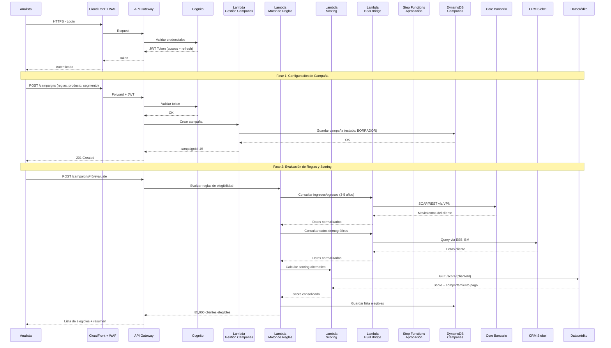
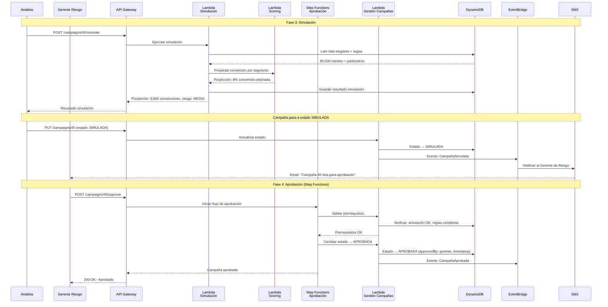
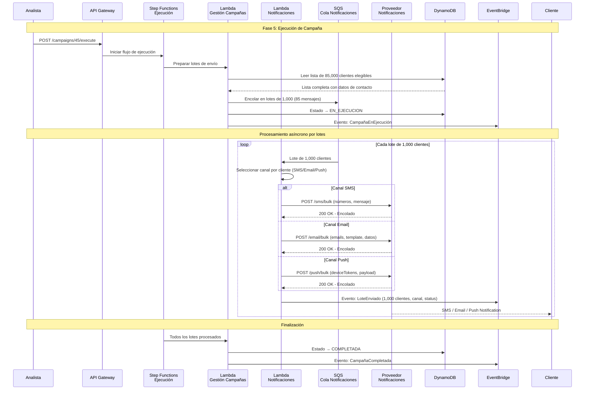
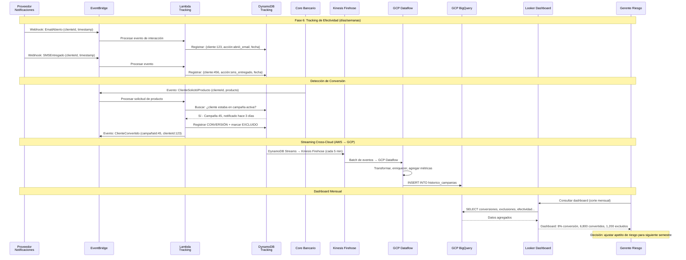
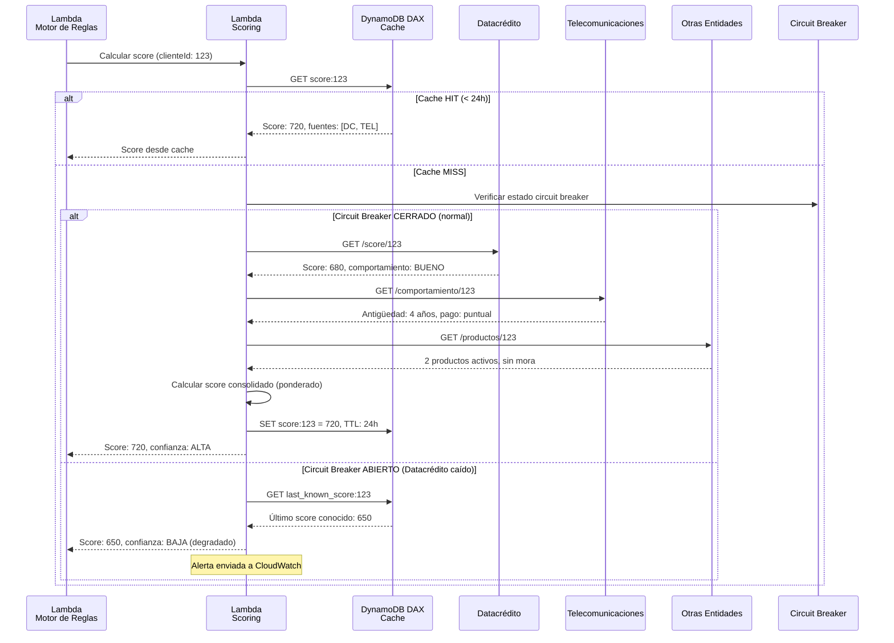
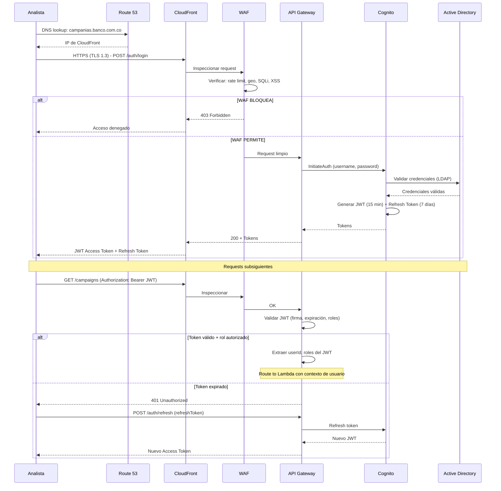

# 6b. Diagramas de Secuencia - CAM-TOBE-06 Serverless AWS+GCP

## 1. Flujo Principal: Creación y Ejecución de Campaña

## 2. Flujo de Simulación y Aprobación

## 3. Flujo de Ejecución y Notificación Multicanal

## 4. Flujo de Tracking y Dashboard (Cross-Cloud)

## 5. Flujo de Scoring Alternativo (Detalle)

## 6. Flujo de Autenticación y Seguridad

## Resumen de Flujos

| # | Flujo | Servicios involucrados | Tipo |
|---|-------|----------------------|------|
| 1 | Creación y evaluación | API GW → Lambda Campañas → Lambda Reglas → Lambda Scoring → ESB Bridge → Core/CRM/Datacrédito | Síncrono |
| 2 | Simulación y aprobación | API GW → Lambda Simulación → Step Functions → DynamoDB → EventBridge → SNS | Síncrono + Evento |
| 3 | Ejecución y notificación | Step Functions → Lambda Campañas → SQS → Lambda Notificaciones → Proveedor externo | Asíncrono (batch) |
| 4 | Tracking y dashboard | EventBridge → Lambda Tracking → DynamoDB → Kinesis Firehose → Dataflow → BigQuery → Looker | Asíncrono (streaming) |
| 5 | Scoring alternativo | Lambda Scoring → Cache → Datacrédito/Telecom/Otras + Circuit Breaker | Síncrono con fallback |
| 6 | Autenticación | CloudFront → WAF → API Gateway → Cognito → Active Directory | Síncrono |
