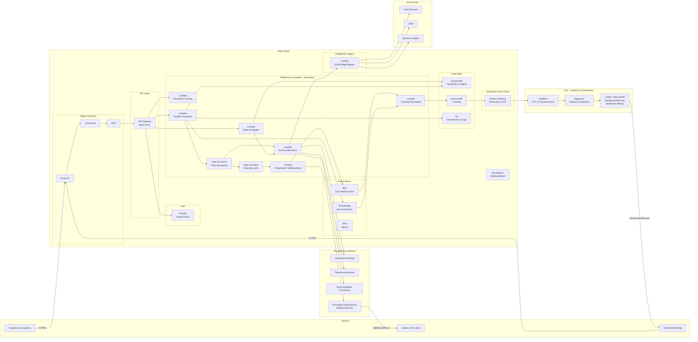

# Arquitectura Serverless Multinube - Sistema de Campañas TO-BE

## AWS (Plataforma de Campañas) + GCP (Analítica y Dashboards)

### Decisión de Re-Platform

| Aspecto | Decisión |
|---------|----------|
| Motivación | Aplicativo actual desactualizado y sin soporte |
| Estrategia | Re-platform a serverless multinube |
| AWS | Rediseño del aplicativo de campañas (compute, integración, datos operacionales) |
| GCP | Almacenamiento de históricos y generación de dashboards con analítica |
| Patrón | Event-driven serverless + streaming cross-cloud |

---

## Diagrama de Solución



---

## Componentes AWS (Plataforma de Campañas)

| Servicio AWS | Componente | Función |
|-------------|-----------|---------|
| Route 53 | DNS | Resolución de dominio |
| CloudFront | CDN | Distribución de contenido estático (SPA) |
| WAF | Firewall | Protección contra ataques web |
| Cognito | Auth | Autenticación OAuth2/OIDC, MFA, integración AD |
| API Gateway | API Layer | Exposición de APIs REST, rate limiting, versionado |
| Lambda (x6) | Compute | Motor de reglas, simulación, gestión campañas, scoring, notificaciones, tracking |
| Step Functions (x2) | Orquestación | Flujo de aprobación y ejecución de campañas |
| EventBridge | Eventos | Bus de eventos para comunicación asíncrona |
| SQS | Cola | Buffer para notificaciones masivas |
| SNS | Alertas | Notificaciones internas y alertas operativas |
| DynamoDB (x2) | Data operacional | Campañas/reglas y tracking de efectividad |
| S3 | Storage | Documentos, logs, archivos de integración |
| Kinesis Firehose | Streaming | Envío de datos de tracking hacia GCP |
| CloudWatch | Observabilidad | Logs, métricas, alarmas, tracing |

## Componentes GCP (Analítica y Dashboards)

| Servicio GCP | Componente | Función |
|-------------|-----------|---------|
| Data Lake (GCS + BigQuery) | Almacenamiento | Patrón de espacios y acceso directo. Almacena grandes volúmenes de datos replicados desde sistemas internos |
| Dataflow | ETL | Transformación de datos streaming desde AWS. Ingesta y calidad de datos |
| NEW APP Campañas (SaaS) | Analítica Avanzada | Servicio SaaS conectado al Data Lake para modelos de analítica avanzada y scoring |
| Looker / Data Studio | Dashboard | Dashboard mensual, apetito de riesgo, efectividad |

### Restricción del Data Lake
> No todos los datos requeridos para las campañas se están replicando al Data Lake actualmente,
> aunque ya se tiene un proceso de replicación, ingesta de datos y calidad de información.
> El MVP debe contemplar completar la replicación de las fuentes faltantes.

## Flujo Cross-Cloud (AWS → GCP)

```
DynamoDB (Tracking) → DynamoDB Streams → Kinesis Firehose → GCP Dataflow → BigQuery → Looker
```

| Paso | Servicio | Acción |
|------|---------|--------|
| 1 | DynamoDB Streams | Captura cambios en tabla de tracking |
| 2 | Kinesis Firehose | Bufferea y envía batch a GCP (cada 5 min o 5MB) |
| 3 | Dataflow | Transforma y enriquece datos para analítica |
| 4 | BigQuery | Almacena histórico, permite queries SQL analíticos |
| 5 | Looker | Genera dashboard con corte mensual para gerencia |

## Notas de Arquitectura

| Aspecto | Detalle |
|---------|---------|
| Resiliencia | Lambda con retry automático, DLQ en SQS, Step Functions con manejo de errores |
| Escalabilidad | Serverless auto-escala. DynamoDB on-demand. Firehose auto-scaling |
| Seguridad | WAF + Cognito + IAM Roles (least privilege) + cifrado en tránsito y reposo |
| Costo | Pay-per-use. Sin servidores idle. BigQuery por consulta |
| Observabilidad | CloudWatch Logs + Metrics + X-Ray tracing |
| Compliance | Datos PII cifrados. Cognito MFA. Audit trail en CloudTrail |
| Disponibilidad | Multi-AZ automático (Lambda, DynamoDB, API Gateway) |
